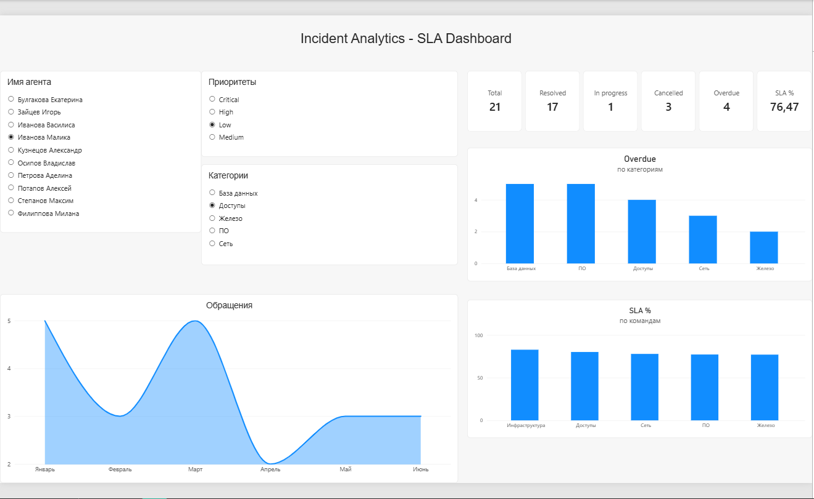

# Incident Analytics — SLA Dashboard

## Цель
Проанализировать SLA инцидентов и выявить проблемные команды и категории.

## Данные
- 5000 инцидентов за 180 дней (январь–июнь 2026).
- 5 таблиц: incidents, teams, priorities, categories, agents.

## Инструменты
- SQL (SQLite) — анализ метрик.
- Python — генерация данных.
- Power BI — дашборд и DAX-меры.

## Метрики
- Total Incidents: 5000
- Resolved: 4224
- SLA %: 79.45%
- Overdue: 868

## Ключевые выводы
- SLA стабилен в диапазоне 78–80% по всем командам.
- Категория «База данных» — лидер по просрочкам (~185).
- Февраль — провал по количеству обращений (~740), май — пик (~910).

## Структура проекта
- `queries.sql` — SQL-запросы для расчёта метрик.
- `incident_dashboard.pbix` — файл Power BI.
- `screenshots/` — скриншоты дашборда.
- `data/` — исходные CSV.

## Скриншот
